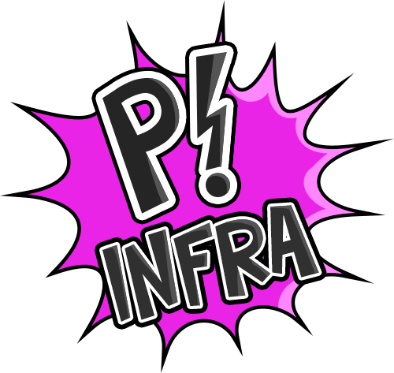
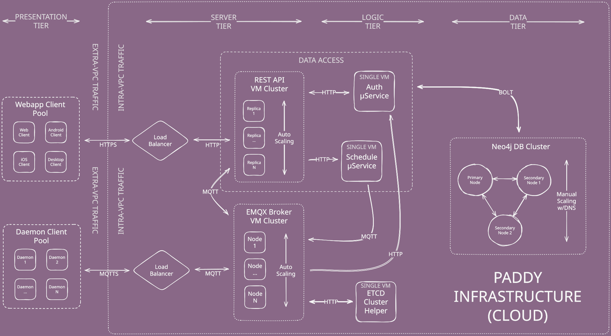

    

# Paddy Infrastructure

This is the IaaC component for Paddy, the Power Administration Daemon.

It uses [Terraform](https://www.terraform.io/) on Google Cloud as a target, using a bucket as a backend.

The job of this code is to deploy the proper infrastructure for the whole Paddy project to run on it. Specifically, here are the components it creates an environment for:

1. Paddy Auth (Single VM)
2. A Neo4j Database (Single VM) -> To be upscaled to a cluster soon
3. Paddy Backend Cluster (Load Balanced)
4. An EMQX Broker Cluster (Load Balanced)

All application deployments are done on their own VM instance, by using Docker & Docker Compose scripts. Secrets/Variables defined in this repository are carried over to each instance through Google's instance metadata service.

# Architecture Diagram

    

# Overview

This infrastructure maintains high separation of business concerns by creating a clear division between each level and not intermixing services. There is always a clear duty relationship between a microservice and what it ought to do, which helps to keep the business logic in order.
* **Presentation Tier:** In the presentation tier, the Daemons and Client devices are contained. The main purpose of this layer is to perform the highest-level function of the project, such as showing a management interface to users, collecting power statistics and performing switching of the load device.
* **Server Tier:** This tier is the one that receives the traffic from the presentation layer. It mainly consists of command operations and request-response conversations. Since it directly handles connections with the presentation layer, there is a strong focus on scalability. Thus, each service is clustered in replicas.
* **Logic Tier:** This tier is responsible for highly-specific operations that could not be handled solely by the Server tier or that could benefit from running independently. Scheduling and authentication are good examples of this.
* **Data Tier:** Intuitive to understand, this is where the application data is stored. Considering that many services access this layer concurrently, it is also clustered in replicas.
