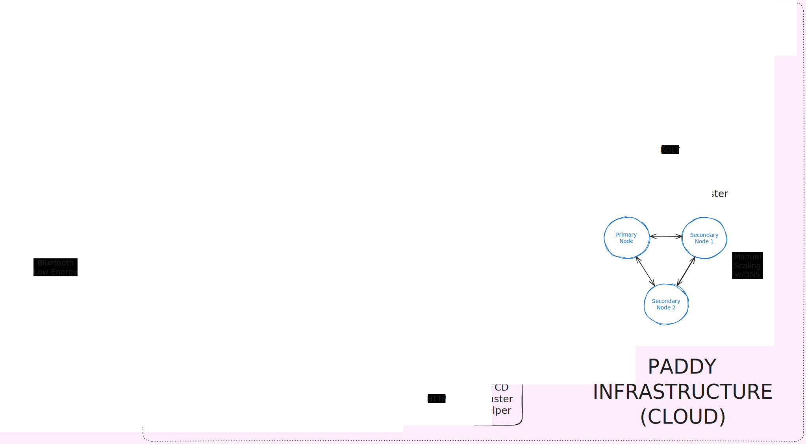

    

> ⚠️ Documentation is still WIP. Expect more updates around May.

# Paddy Infrastructure

This is the IaaC component for Paddy, the Power Administration Daemon.

It uses [Terraform](https://www.terraform.io/) on Google Cloud as a target, using a bucket as a backend.

The job of this code is to deploy the proper infrastructure for the whole Paddy project to run on it. Specifically, here are the components it creates an environment for:

1. Paddy Auth (Single VM)
2. A Neo4j Database (Single VM) -> To be upscaled to a cluster soon
3. Paddy Backend Cluster (Load Balanced)
4. An EMQX Broker Cluster (Load Balanced)

All application deployments are done on their own VM instance, by using Docker & Docker Compose scripts. Secrets/Variables defined in this repository are carried over to each instance through Google's instance metadata service.

# Architecture Diagram

    

